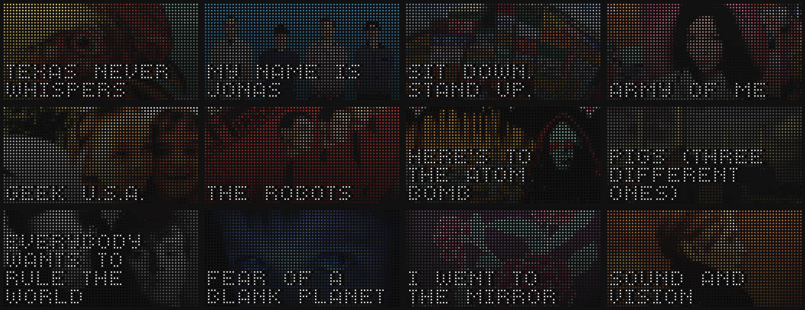

# Plex "Now Playing" for Tidbyt
This Node.js app sends Plex API data from your local music library to a registered Tidbyt device for a nice "now playing" display. We're bypassing the Pixlet runtime in this particular instance and utilizing the unofficial [Tidbyt Node client](https://github.com/drudge/node-tidbyt) instead.

### Getting Started

After running `npm install`, create a `.env` with the following credentials:

    PLEX_SERVER_ADDR=server_ip_here
    PLEX_AUTH_TOKEN=auth_token_here
    TIDBYT_DEVICE_ID=device_id_here
    TIDBYT_API_TOKEN=device_token_here

Run `npm start` to initialize the server. Assuming Plex or Plexamp is currently playing something, you'll see the result both in your console and displayed on your Tidbyt. Every 5 seconds, node-cron will listen for any changes to the API stream. If a change is detected (a new file began playing), the script will deploy to the Tidbyt app rotation again. Here are some examples:

### To-Do

- Fix font dependency (currently requires font to be installed on your system)
- Setup a default "no artwork found" image (currently sends error if nothing is found)
- Handle special characters (current font kinda hates them)
